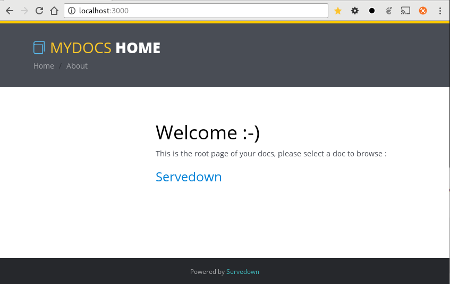

[](http://badge.fury.io/js/servedown)
[](https://travis-ci.org/openhoat/servedown)
[](https://coveralls.io/r/openhoat/servedown)


# Servedown

Serve your markdown documentations

## Why?

- Needed a simple solution to render markdown files in many git projects
- Did not get fully satisfied with [gollum](https://github.com/gollum/gollum) or [smeagol](https://github.com/rubyworks/smeagol)
- Render docs for read-only usage
- Ability to easily customize styles and templates

## Getting started

With a sample configuration, let's serve this project documentation :

- Configuration ~/.servedown.yml :

    ```yml
    repos:
      - name: servedown
        ssh: git@github.com:openhoat/servedown.git
        url: https://github.com/openhoat/servedown
        filePattern: /blob/master/{{file}}
    ```

- Start the server :

    ```shell
    $ servedown
    INFO  - servedown:181 - 131ms - cloning repo "servedown"...
    INFO  - servedown:409 - 4.2s - servedown is listening to 0.0.0.0:3000
    ```

    Now your server is ready...

- Browse :

    ```shell
    $ xdg-open http://localhost:3000
    ```

- Result :

    

    The welcome page is generated from a default template string (or your own index.html)

- Click on "Servedown" doc project :

    

    Now you see your markdown files rendered with styles :-)
 
## Command line

The simplest way to use servedown is the command line.

All you have to do is :

1. setup your servedown configuration file (.servedown.yml) into your home directory
2. run the servedown command

### Installation

```shell
$ npm i servedown -g
```

### Usage

Setup your custom configuration in ~/.servedown.yml :

Have a look at the [default configuration file](blob/master/lib/default-config.js) to understand all the customizable features.

Starts the servedown doc server :

```shell
$ servedown
```

If repos are specified in configuraton servedown will checkout them into the working directory (~/.servedown), then it will compute recursively the working dir to render the doc site.

## Module

If you prefer to embed servedown features into an existing express app, then use the provided middleware.

### Installation

```shell
$ cd yournodeproject
$ npm i servedown --save
```

### Usage

```javascript
const path = require('path');
const express = require('express');
const ServeDown = require('../lib/servedown');
const app = express();

const servedown = new ServeDown(); // Create a servedown instance

servedown.init({ // Initialize with custom config
  cacheDir: path.join(__dirname, '..', '.working', 'cache'), // Cache dir
  repos: [{ // Git repos to get the markdown docs from
    name: 'servedown',
    url: 'https://github.com/openhoat/servedown'
  }]
});
app.use(servedown.buildExpressRouter()); // Use provided express middleware
app.listen(3000, () => {
  servedown.process(() => {  // Prepare html rendering
    console.log('ready');
  });
});
```

## Principles and conventions

Here's a short description of how servedown works :

- servedown first loads the configuration (init)
- if there are git repos, a git pull or clone is executed for each repo
- all source files are scanned
- each markdown file is converted to html content
- html content and meta datas are stored in a filesystem cache (specified by cacheDir in configuration)

Conventions :

- each doc project is associated with a context name (directory of the git url)
- static theme assets are served with /assets/* route
- /search route is reserved to the search form page
- all doc routes are based on the doc file path encoded to a valid uri (lowercase, spaces replaced by '-')
- any doc file name matching the configured index pattern is considered as a welcome page for its parent directory (/mypath/home.md is exposed as /mypath/)

## Features

### Configuration format

Servedown supports json, js, or yaml format for configuration file.

### Git support

**Prerequisite : git command installed**

Add your git repositories and servedown will automatically checkout them.
 
By default, servedown will optimize the clone operation : only markdown files are fetched.

### Theme support
 
Use one of the two themes provided or use your owns, and hot switch the current theme with **?theme=**

### TOC support
 
Table of contents is dynamically generated from the level 2 headers of markdown contents, look at mydocs theme template example to see how TOC is rendered.

### Git source link

Optionnaly show the source link of the current document to make documentation changes easy.

### Hot update

Add **?update** to your browser address and it will reload, included git update.

### Search support

Add ?q=anysearch to your browser address and servedown will search through your docs, show matches in a search result page and highlight the results into the doc content.

Into the doc content, press 'n' or 'p' to go to next/previous matching.

The /search route provides a default search form overridable by search.html theme template.

### Markdown extensions

#### Link title

```
[[ My Title ]]
```

This is shorthand to [My Title](my-title)

#### Include

```
[[ include: my/doc/to/include.md ]]
```

Specified doc path is included into content, relative or absolute paths are supported, file extension is required.

#### Web sequence diagrams
 
Embed your [websequence diagrams](https://www.websequencediagrams.com/) in md content with **{{{{{{** **}}}}}}** tags.

Example :

```
{{{{{{ modern-blue

title Authentication Sequence

Alice->Bob: Authentication Request
note right of Bob: Bob thinks about it
Bob->Alice: Authentication Response

}}}}}}
```


Enjoy!
